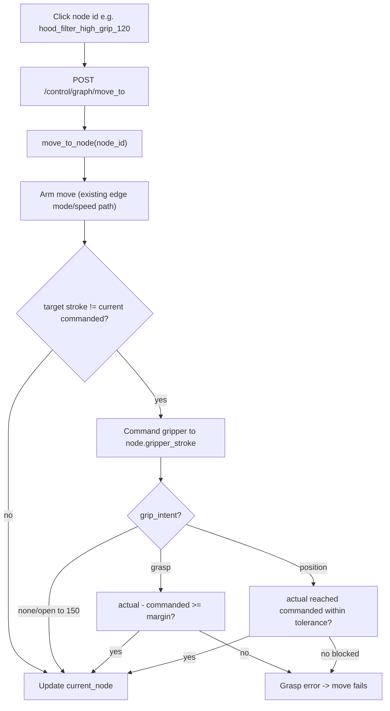

# Gripper-stroke node refactor

## Goal

Make the gripper's commanded stroke and its **intent** first-class, and make arriving at a node actually drive the gripper. Both stroke and intent are encoded in the node id suffix:

- `*_empty` (and bare pose names like `robot_home`) -> gripper fully open (stroke 150), intent `none`, no verification.
- `*_grip_<n>` -> close to `<n>` with **grasp** intent: an object is expected, so the jaws should settle **above** `<n>`.
- `*_open_<n>` -> close to `<n>` with **position** intent: no object expected, so the jaws should actually **reach** `<n>` (e.g. tucking the fingers in for clearance).

Convention (Bio Gen2, from [src/settings/gripper_config.yaml](src/settings/gripper_config.yaml)): **150 = fully open, 71 = fully closed**, so a smaller number is a tighter close.

For this pass: rename every current `*_held` node to `*_grip_120`. The `*_open_<n>` (position) nodes will be introduced later by the operator. The six legacy `*_press` poses keep their names for now (see below).

## Why intent is needed

A "close to stroke N" command means two different things and verification depends on which:

- Grasp (pick a plate): the object blocks the jaws, so `actual > commanded` is success; reaching `commanded` means nothing was grabbed -> failure.
- Position/clearance (tuck fingers to avoid a neighbor): free travel is expected, so reaching `commanded` is success; being blocked early is the anomaly.

Stroke value alone can't distinguish them, so intent rides in the id suffix (`grip` vs `open`).

## Design decisions (confirmed)

- Verification: **position tolerance only** (no hardware `object_detected` for now).
- Grasp failure: **treat the move as failed (error/abort)**. Position failure (jaws blocked / didn't reach): also an **error**.
- Data model: **raw stroke + intent**, both parsed from the node id. The named `gripper_states`/`grip_plate` abstraction and the `payload` dimension are dropped.

## Source of truth for stroke + intent

- The loader parses `gripper_stroke` and `grip_intent` from the id suffix: `_empty` -> (150, none); `_grip_<n>` -> (n, grasp); `_open_<n>` -> (n, position). No `gripper`/`payload` field on those YAML nodes.
- **One documented exception:** the six holding `*_press` nodes (`opentrons_2_low_press`, `opentrons_4_low_press`, `opentrons_6_low_press`, `deck_slot1_low_press`, `deck_solid_low_press`, `hood_shaker_low_press`) keep their current names, so they can't be parsed. They carry an explicit `gripper_stroke: 120` + `grip_intent: grasp` block as a temporary bridge until renamed.

## Two implementation subtleties to get right

1. Node identity uses the **commanded** stroke, not the live actual reading. During a good grasp the actual stroke is deliberately not equal to the commanded value, so we track `last_gripper_commanded_stroke` and resolve nodes against it. The actual reading is used only for verification pass/fail.
2. Only actuate the gripper when the target stroke differs from the current commanded stroke, so transit moves that keep the same stroke don't re-grip.

## Flow after the change

## Changes by file

### 1. Data model - [src/core/motion_graph.py](src/core/motion_graph.py)
- Add a `GripIntent` enum (`GRASP`, `POSITION`, `NONE`).
- `Node`: replace `gripper: str` + `payload: str` with `gripper_stroke: float` and `grip_intent: GripIntent`.
- Loader: parse `gripper_stroke` + `grip_intent` from the id suffix (`_empty` / `_grip_<n>` / `_open_<n>`); fall back to explicit YAML `gripper_stroke` + `grip_intent` for ids that don't match (the legacy `_press` nodes).
- Remove `GripperState`, `Payload`, and the `gripper_states`/`payloads` maps. Remove `GripAction`/`ReleaseAction` and `Edge.grip`/`Edge.release`; keep `mode`/`speed`.
- `_validate_topology`: drop the payload/open-gripper coherence rules; add a `gripper_stroke` range check (71-150) and verify each id's parsed suffix matches its computed stroke/intent.
- `find_node(...)`: drop `payload`; the gripper argument becomes the commanded stroke.
- `find_nearest_node(...)`: drop `declared_payload`; match gripper by commanded stroke.
- `ControllerView`: drop `gripper_payload`, keep `gripper_stroke`. Redefine or remove the `gripper_empty`/`plate_held` preconditions in stroke terms.

### 2. Graph data - [src/settings/motion_graph.yaml](src/settings/motion_graph.yaml)
- Rename every `*_held` node id to `*_grip_120`, and every edge `from`/`to` that references them.
- Drop the `gripper`/`payload` fields on all suffix-parseable nodes (`*_empty` and `*_grip_120`).
- Keep the six `*_press` node names; add explicit `gripper_stroke: 120` + `grip_intent: grasp` to each (temporary bridge).
- Delete the `gripper_states:` and `payloads:` sections and all edge `action:` blocks; update the header and coherence comments.

### 3. Actuation + state - [src/core/xarm_controller.py](src/core/xarm_controller.py)
- Add `last_gripper_commanded_stroke`; set it in `open_gripper`/`close_gripper`/`move_gripper_to_stroke` (distinct from the actual value read by `get_gripper_position`).
- Update the `current_node` property and replace `_gripper_state_name()` so the gripper dimension resolves from `last_gripper_commanded_stroke`; remove `declared_payload` (update `recover_to` to set commanded stroke from the target node instead of payload).
- Add `move_to_node(node_id)`: run the existing arm-move path (edge mode/speed), then, if the node's `gripper_stroke` differs from the current commanded stroke, command the gripper and verify per `grip_intent`.

### 4. Intent-aware verification + config - [src/core/xarm_controller.py](src/core/xarm_controller.py), [src/settings/gripper_config.yaml](src/settings/gripper_config.yaml)
- Add `_verify_gripper(commanded_stroke, intent)`: read actual via `get_gripper_position()`.
  - `grasp`: success iff `actual - commanded >= grasp_min_offset` (and `<= grasp_max_offset` if set); else raise (nothing / slipped).
  - `position`: success iff `abs(actual - commanded) <= position_tolerance`; else raise (jaws blocked / didn't reach).
  - `none`: skip.
- Add under `bio_gen2`: `grasp_min_offset`, optional `grasp_max_offset`, `position_tolerance`, and a default grip `force`.

### 5. API - [src/core/xarm_api_server.py](src/core/xarm_api_server.py)
- `graph_move_to`: call `move_to_node` and surface a verification failure as an error response.
- `GraphNodeCreateRequest` and `/graph` serialization: expose `gripper_stroke` + `grip_intent` (derived), drop `gripper`/`payload`; edge create/serialization drop `grip`/`release`.
- `recover_to` and `/graph/nearest`: drop payload.

### 6. Status - [src/core/status_builder.py](src/core/status_builder.py)
- `_build_motion_graph_details`: remove `declared_payload`; expose `gripper_stroke`, `grip_intent`, and the last verification result. (`_build_gripper_details` already reports actual position and `object_detected`.)

### 7. Web UI - [src/web/graph.js](src/web/graph.js), [src/web/graph.html](src/web/graph.html), [src/web/main.js](src/web/main.js)
- Node display/editor: reflect the id-encoded stroke + intent; base the open/grip/position glyph on those. Update the `deck_solid_high_held` placeholder to `deck_solid_high_grip_120`. Node-id buttons/dropdowns already work with the new string ids.

### 8. Tests - [test/](test/)
- Update `test_motion_graph.py`, `test_motion_graph_phase2.py`, `test_motion_graph_phase4.py`, `test_motion_graph_api.py` for id-suffix parsing (stroke + intent), the explicit `_press` fallback, new `find_node`/`find_nearest_node` signatures, and removed coherence rules; add grasp-pass, grasp-fail, position-pass, and position-fail verification tests.

## Out of scope
- No new per-node grip force tuning UI (uses a config default; force can be reintroduced later).
- Renaming the `_press` nodes to the new convention (operator will do this later).
- Composite workflow `move_plate_linear` still bypasses the graph; not changed here.
