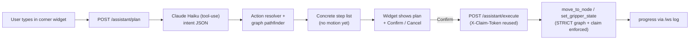

# Lab Assistant Chatbox for Robot Motion

## Design principle
The LLM (Claude Haiku) is used **only** for natural-language → structured intent. All motion planning, pathfinding, and safety enforcement stay deterministic in the backend. This keeps the LLM out of the safety loop and works within the device-driver scope (single-robot motion, not cross-device orchestration).

## Flow

## 1. Motion-graph pathfinder (new capability)
File: [src/core/motion_graph.py](src/core/motion_graph.py)

Today there is **no multi-hop routing** — `find_edge` is direct-only and STRICT mode rejects any move without a direct whitelisted edge. Add a state-space search:

- New method `find_path(from_node, from_gripper_state, to_node, to_gripper_state=None)`.
- Search over states `(node_id, gripper_state)`. Neighbors:
  - **Move edges**: reuse `allowed_targets_for_state(node, gripper_state)` — traverse an edge keeping the gripper state (must be allowed at both endpoints).
  - **Gripper transitions**: reuse `allowed_gripper_targets(node, current_state)` — change gripper while parked.
- BFS/Dijkstra (cost = hop count, lightly penalize gripper changes). Return an ordered list of steps: `{kind: "move", to, mode, speed}` or `{kind: "gripper", state}`. Return `None`/reason if unreachable.

## 2. Action resolver (place names + pick/place composition)
New file: `src/core/assistant_actions.py`

- Build a **location catalog** from graph node ids + tags (e.g. `deck`, `slot1`, `hood`+`shaker`, `opentrons`+`slot2`, `cytation`, `uplc`, `home`), exposing friendly place keys and their `_home`/`_high`/`_low` node ids via the existing naming convention (e.g. `deck_slot1_high`/`deck_slot1_low`).
- Compose intents into concrete step lists using the pathfinder:
  - `move_to(place)` → path `current → <place representative node>`.
  - `pick(place)` → path to `<place>_high`, descend `_high→_low`, gripper `empty→grip_120`, ascend `_low→_high`.
  - `place(place)` → path to `<place>_high` (holding), descend, gripper `grip_120→empty`, ascend.
  - `set_gripper(state)`, `go_home()`.

## 3. LLM layer (Claude Haiku)
New file: `src/core/assistant_llm.py`

- Use the `anthropic` SDK with **tool-use / function calling**. Tools mirror the resolver actions (`move_to`, `pick`, `place`, `set_gripper`, `go_home`) with an `enum` of valid place keys built from the catalog.
- System prompt: robot is a translocation arm; only motion control; current node + gripper state injected each call; must map user phrasing to one tool call (or ask for clarification / refuse if out of scope).
- Model configurable via `XARM_ASSISTANT_MODEL` (default a Claude Haiku slug — confirm exact current slug at build time); key from `ANTHROPIC_API_KEY`.
- Graceful degradation: if lib/key missing, endpoints return a clear "assistant disabled" error and the widget shows a disabled state.

## 4. Backend endpoints
File: [src/core/xarm_api_server.py](src/core/xarm_api_server.py)

- `POST /assistant/plan` — body `{message, history?}`. Calls Haiku → intent → resolver → returns `{interpretation, steps[], feasible, reason?}`. **No motion.** Read-only w.r.t. hardware.
- `POST /assistant/execute` — body `{steps[]}` (or a short-lived plan id). Gated by `require_claim` (reuses the user's `X-Claim-Token`). Runs each step via existing `controller.move_to_node()` / `set_gripper_state()` (STRICT graph + verification already enforced), emitting progress over the existing `/ws` `log` channel. Stops on first failure and reports it.
- Follow existing Pydantic-model + claim-dependency patterns already in this file.

## 5. Frontend corner widget
Files: [src/web/index.html](src/web/index.html), [src/web/main.js](src/web/main.js), [src/web/style.css](src/web/style.css)

- Floating FAB bottom-right that expands into a chat panel (`position: fixed`, z-index above the `.status-bar-card` at z-index 50; offset above the 84px footer).
- Message list + input. On send → `apiRequest('/assistant/plan', 'POST', {message})`, render the interpretation + numbered step list with **Confirm** / **Cancel** buttons (preview-then-confirm).
- On Confirm → `apiRequest('/assistant/execute', 'POST', {steps})`; reuse existing WS `log`/`status_update` handling to show live progress; disable input while executing.
- Reuse the existing `apiRequest()` helper (auto-attaches `X-Claim-Token`) and `BASE_PATH`. If the user doesn't hold the claim, show the same "take control first" guidance the UI already uses.

## 6. Dependencies & config
Files: [pyproject.toml](pyproject.toml)

- Add `anthropic` to dependencies.
- New env vars: `ANTHROPIC_API_KEY` (secret), optional `XARM_ASSISTANT_MODEL`, optional `XARM_ASSISTANT_ENABLED` (default on when key present).

## Notes / non-goals
- No cross-device orchestration (no Opentrons/UPLC/filter/shaker workflow) — motion of this arm only, consistent with the device-PC rules.
- Physical motion always requires an explicit Confirm click and a held control claim.