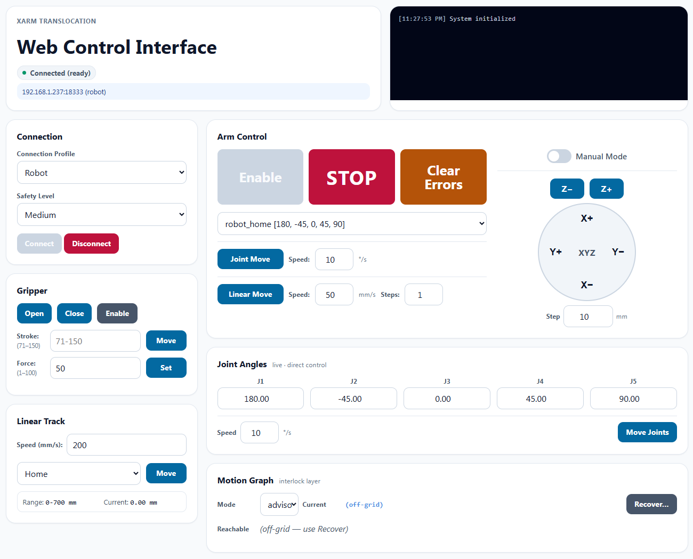

# xArm Translocation

UFACTORY xArm control for the AC Organic Self-Driving Lab — arm, gripper, linear track, and force-torque sensor, driven through one Python controller, a web UI, and a STATUS_SPEC v1.2 REST API. The Docker simulator is the supported path for off-hardware testing. Installs as the `pyxarm` package.



## Lab Status Spec Conformance

This repo conforms to **lab status spec v1.2**. Wire-contract types come from the shared [`sdl-lab-contract`](https://github.com/AccelerationConsortium/sdl-lab-contract) package (pinned to `v1.2.0`) rather than a vendored `models.py`. The FastAPI service exposes the standard read surface so the AC Organic Self-Driving Lab dashboard can poll it like any other device:

- `GET /` -- `ProbeResponse` (`equipment_id`, `equipment_name`, `protocol_version`)
- `GET /health` -- `HealthResponse(status="healthy")`
- `GET /status` -- `EquipmentStatus` envelope (snake_case, side-effect-free)
- `GET /positions` -- read-only snapshot of joint angles, Cartesian pose, track position, and gripper position (no movement)
- `GET /openapi.json` -- generated by FastAPI

The v1.1 claim surface (`POST /control/claim`, `/control/heartbeat`, `/control/release`) is implemented with **hard enforcement**: every mutating endpoint requires the active claim's `X-Claim-Token` or returns HTTP 423 — including when no claim is held at all. `/move/stop`, `/clear/errors`, `/connect`, and `/disconnect` stay ungated as the safety floor. Set `XARM_ENFORCE_CLAIMS` falsy to drop back to advisory mode for demos.

The browser UI lives at [`/web/`](http://localhost:8000/web/). The xArm-specific control endpoints (`/move/*`, `/gripper/*`, `/track/*`, `/force-torque/*`, `/connect`, `/disconnect`) are unchanged; programming the arm continues to happen via these or the `XArmController` Python SDK. The SDK in `ac-organic-lab` keeps `do_not_call_connect: true` for this device — a robot arm is never auto-connected.

### Primary operation (v1.2 `activity`)

v1.2 splits "is this arm healthy" (`equipment_status`) from "is it working right now" (`activity`). For this device the **primary operation is a commanded arm or linear-track motion**: `activity` is `running` from the moment a motion primitive dispatches its SDK call until that call returns, and `idle` otherwise. It is observed from the controller's motion bookkeeping, never derived from `equipment_status`.

Consequences worth knowing as a reader:

- **Gripper actuation is not primary operation.** Grip / release happens while parked at a graph node with the arm stationary, and takes well under a second. It shows in `components.gripper` and `details.gripper`, not on the activity axis.
- **`activity_since` is the transition instant**, latched when the motion flag flips — not the time of the poll that observed it. Two polls of the same in-flight move report the same value, so elapsed move time is recoverable.
- **`degraded` + `running` is expressible and does occur.** A connected-but-not-fully-alive controller mid-move reports both; neither fact suppresses the other. Consequently `busy` and `degraded` never co-occur (spec §2.3).
- **Polling cannot see every move.** The dashboard polls at 60 s while a graph hop can take a few seconds, so a sampled `activity` series is not usage accounting (spec §2.3.1). This device does not yet publish `metrics["cycles_total"]`; the `state_transition` rows the events exporter pushes to `POST /api/ingest/events` are the timing-accurate record.

### One motion at a time

Only one motion may be in flight. A move arriving while another is running is refused with **HTTP 409** and a body distinguishable by shape:

```json
{"detail": {"error": "motion_in_progress",
            "message": "A motion is already in flight. Wait for it to finish, or POST /move/stop to abort it."}}
```

This is 409 rather than 412 because it is a device-state conflict, not a precondition the caller could have satisfied in advance (spec §6.1). `allowed_actions` mirrors it: while `activity` is `running`, every `move.<node_id>` target is withheld and only `stop` remains, so a client that reads `/status` and immediately POSTs a listed move is never refused for being busy (§6.2).

Covered: `/move/{position,joints,relative,location,home,plate_linear}`, `/track/move`, `/track/move/location`, `/control/graph/{move_to,travel_to}`, `/assistant/execute`, and both `/force-torque/move-*` endpoints. A composite move holds the slot for its whole duration — a cross-rail graph edge is two sub-moves, a travel is N hops, and an assistant run is a whole step list, none of which release between parts.

Not covered, deliberately: `/move/stop` and `/clear/errors` (the safety floor must always be reachable), `/control/graph/recover_to` (a bookkeeping re-pin, not a motion), and the gripper endpoints (`set_gripper_state` already refuses while the arm is moving, and gripper actuation is not primary operation).

The contract is defined in `ac-organic-lab/docs/STATUS_SPEC.md`.

## ✨ Key Features

- **Multi-Model Support**: xArm5, xArm6, xArm7, and xArm850 with auto-detection
- **Unified Control**: Single controller for arm, gripper, linear track, and force torque sensor
- **Docker Simulator Support**: Drive the official UFACTORY Docker simulator through the same controller path used for hardware
- **REST API**: FastAPI server for web-based control and monitoring
- **Flexible Configuration**: Model-specific configs with component auto-enable
- **6-Axis Force Torque Sensor**: Safety monitoring, force-controlled movement, and torque-controlled joint operations

## 🚀 Quick Start

### Installation
```bash
# Prepare and activate your python enviroment, and install PyxArm in editable mode
pip install -e .

# Or, install PyxArm in development mode with pytests
pip install -e ".[dev]"
```

### Basic Usage
```python
from src.core.xarm_controller import XArmController

# Auto-detect and connect
controller = XArmController(
    gripper_type='bio',
    enable_track=True,
    auto_enable=True
)

if controller.initialize():
    # Move robot
    controller.move_to_position(x=300, y=0, z=300)
    controller.open_gripper()
    controller.disconnect()
```

### Running against the Docker simulator
```bash
# Start the simulator (e.g. "5" for xArm5)
src/docker/docker_setup.sh start 5

# Drive it with the demo using the `docker` profile
python src/examples/demo_docker_sim.py
```

The in-process software simulation has been removed; use the Docker simulator for all simulator-mode work. See [PYXARM_TESTING.md](src/docs/PYXARM_TESTING.md) for setup details.

### Web Interface & API Server
```bash
# Start the web UI (also auto-starts the API server on port 8000)
pyxarm web

# Or specify a custom host/port for the web UI
pyxarm web --host 0.0.0.0 --port 6001

# Run only the API server (this is how it is deployed as a device service)
pyxarm api --host 0.0.0.0 --port 8000

# Alternative method (without installing package)
python -m src.cli.main web
```

**Access Points:**
- 🌐 **Web UI**: http://localhost:6001/web/
- 📖 **API Docs**: http://localhost:8000/docs
- 📡 **API Server**: http://localhost:8000

## 💻 Command Line Interface

PyxArm includes a convenient command-line interface:

```bash
# Show help
pyxarm --help

# Start web interface
pyxarm web

# Start on custom host/port
pyxarm web --host 127.0.0.1 --port 8080

# Show version
pyxarm --version
```

## 🎯 Testing Strategy

1. **Docker Simulator** → run the official UFACTORY simulator via the `docker` profile for off-hardware validation
2. **Real Hardware** → production validation against the configured `robot` profile

## 📚 Documentation

For detailed guides on specific topics, please see the project root:

-   **[Features Overview](./src/docs/PYXARM_FEATURES.md)**: A high-level overview of the controller's features.
-   **[API Reference](./src/docs/PYXARM_API.md)**: Detailed documentation of the `XArmController` methods and parameters.
-   **[Simulation & Testing Guide](./src/docs/PYXARM_TESTING.md)**: A comprehensive guide to simulation modes and the project's testing strategy.
-   **[Network Access](./src/docs/NETWORK_ACCESS.md)**: Tailscale port-forwarding setup for remote access to both the PyxArm API and the official UFactory Studio UI.

## 🔧 Advanced Features

- **Multi-gripper support**: BioGripper Gen1, BioGripper Gen2 (stroke + force control), Standard, RobotIQ, or none
- **Named locations**: Predefined positions with easy recall
- **Real-time monitoring**: WebSocket updates and status tracking
- **Error handling**: Comprehensive error history and recovery
- **Remote deployment**: Docker containers on web servers
- **Configuration**: All settings are now in `src/settings/`. Modify the `.yaml` files to match your hardware.
- **Examples**: Run demo scripts in `src/examples/` to see different functionalities.
- **API Server**: Start the web server with `pyxarm web` or `uvicorn src.core.xarm_api_server:app --reload`.

## 🤝 Contributing

1. Fork the repository
2. Create a feature branch
3. Add tests for new functionality
4. Ensure all tests pass: `pytest`
5. Submit a pull request

## 📄 License

This project is licensed under the MIT License - see the [LICENSE](LICENSE) file for details.

## 🆘 Support

- **Issues**: Create GitHub issues for bugs and feature requests
- **Documentation**: Check root directory for comprehensive guides
- **Examples**: Run demo scripts in `src/examples/`
- **CLI**: Use `pyxarm --help` for command-line interface
- **API**: Access interactive docs at `http://localhost:8000/docs`

---

**Get started in minutes against the Docker simulator, then move to real hardware when ready.**
